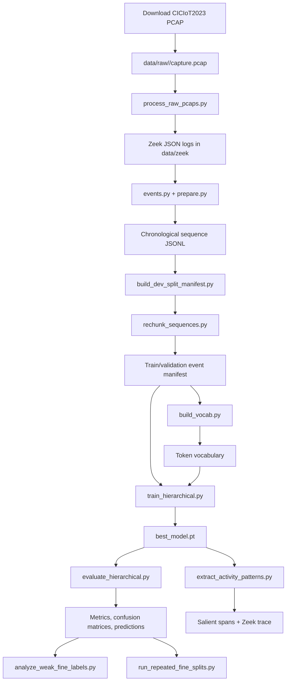

# Professor Demo Runbook and Project File Map

本文件用于现场演示。给教授发送的简短英文报告是 `deliverables/ECE9065_Project_Progress_Report.docx`，报告的 Git 可读源文件是 `docs/progress_report.md`。

## 1. Demo 目标

教授的邮件要求确认三件事：

1. 你具体完成了什么，以及 Git 仓库如何证明这些工作。
2. 现有方法是什么，本项目与它们有什么区别。
3. 软件是否真正能够运行，而不仅是研究计划或静态报告。

建议 Demo 总时长控制在 15 到 20 分钟。

## 2. Demo 前检查

提前完成：

- 确认 Zeek、Python 和项目 `.venv` 可以运行。
- 确认 `runs/hierarchical_event256_joint/best_model.pt` 存在。
- 确认 `artifacts/evaluation_event256_joint/metrics.json` 存在。
- 确认 `artifacts/activity_patterns_event256_joint/patterns.md` 存在。
- 关闭无关窗口和包含个人信息的终端。
- 准备本地仓库和 GitHub 仓库两个窗口。
- 不要现场重新训练 4 epochs；完整训练约 12 分钟且不增加演示价值。
- 准备说明当前已覆盖全部 33 种官方攻击加 Benign，共 34 个输出标签；同时说明 DDoS-ICMP Fragmentation 的 121 个 segments 仍来自单一 PCAP。

演示前运行：

```bash
git status --short --branch
```

报告和 Demo 文件提交后，理想状态应该只显示：

```text
## main...origin/main
```

## 3. 推荐时间安排

| 时间 | 内容 | 目的 |
| ---: | --- | --- |
| 0-2 min | 研究问题与现有方法差异 | 说明项目价值 |
| 2-5 min | PCAP、Zeek 和事件输入 | 证明不是 CSV 特征分类 |
| 5-8 min | 分层 LSTM 与训练配置 | 解释软件核心 |
| 8-11 min | 指标、混淆和错误分析 | 展示当前成果并诚实解释低分项 |
| 11-14 min | Activity pattern 与 trace reconstruction | 展示“identifying patterns”而不只是分类 |
| 14-16 min | 测试和 Git 历史 | 证明代码可运行和工作记录 |
| 16-20 min | Limitations、下一步和提问 | 明确项目边界 |

## 4. 开场讲解

英文开场：

> My project investigates whether an LSTM can identify interpretable IoT intrusion activity patterns from chronological protocol-semantic events extracted from raw CICIoT2023 packet captures. Unlike the common benchmark workflow, the proposed model does not receive flow duration, rates, averages, standard deviations, packet totals, or rolling statistics.

接着说明：

- CICIoT2023、Zeek 和 PyTorch 是外部资源，不是原创工作。
- 项目特定部分是事件表示、流水线、标签层级、训练与评估、错误分析、activity pattern extraction 和 trace reconstruction。
- 当前结果属于 development validation，不是 unseen-capture final result。

## 5. 现场演示步骤

### Step 1: 展示 Git 历史

```bash
git log --date=short --pretty=format:'%h  %ad  %s'
```

解释三个主要历史节点：

- `87ee240`, 2026-06-16：研究计划、事件表示、LSTM scaffold 和初始测试。
- `2eb182a`, 2026-06-25：大型 Zeek 采样输出的 Git 管理。
- `2658711`, 2026-07-16：完整分层流水线、评估、重复划分、错误分析和 trace reconstruction。

不要回避 Git 历史比较集中。可以说：

> The implementation history is less incremental than ideal because local work was consolidated before being pushed. I am now keeping the reporting and remaining experiments in smaller commits.

### Step 2: 展示 PCAP 到序列的路径

先显示目录：

```bash
du -sh data/raw data/zeek data/zeek_sample data/sequences data/sequences_windowed
```

当前预期：

```text
40G data/raw
37G data/zeek
3.7G data/zeek_sample
1.4G data/sequences
1.4G data/sequences_windowed
```

使用 dry run 显示软件将执行的转换，不重新处理 2 GB PCAP：

```bash
PYTHONPATH=src .venv/bin/python scripts/process_raw_pcaps.py \
  --only Benign_Final \
  --force-zeek \
  --force-sequences \
  --dry-run
```

预期输出：

```text
zeek: data/raw/Benign_Final/BenignTraffic.pcap -> data/zeek/Benign_Final/BenignTraffic
sequence: data/zeek/Benign_Final/BenignTraffic -> data/sequences/Benign_Final/BenignTraffic.jsonl
```

### Step 3: 展示真实模型输入

```bash
sed -n '1p' data/sequences_windowed/Benign_Final/BenignTraffic.jsonl | \
  jq '{sequence_id, chunk_index, label, event_count:(.events|length), first_events:.events[:3]}'
```

指出事件中的直接字段：

```text
log=conn
proto=tcp
service=http
conn_state=SF
history=SADhgFadf
resp_port=80
```

让教授观察没有以下字段：

```text
IP address, UID, duration, bytes, packet count, rate,
mean, standard deviation, variance, rolling statistics
```

对应实现文件：

```text
src/activity_patterns/events.py
src/activity_patterns/prepare.py
```

### Step 4: 展示标签与模型

打开：

```text
src/activity_patterns/labels.py
src/activity_patterns/model.py
```

讲解：

```text
tokens -> learned embeddings -> LSTM -> coarse head -> category fine head
```

重点解释 `hierarchical_loss()`：训练时真实类别选择 fine head；推理时预测类别选择 fine head。

当前 `labels.py` 中有 34 个输出标签，即官方 33 种攻击加 Benign。DDoS-ICMP Fragmentation 已加入 DDoS fine head；它的 89 个训练和 32 个验证 segments 都来自一个 PCAP，不能把 segment 数量当作独立重复实验。

### Step 5: 展示主实验指标

```bash
jq '{coarse, fine_given_true_category, path_accuracy, total_samples}' \
  artifacts/evaluation_event256_joint/metrics.json
```

按以下顺序讲：

1. Coarse accuracy：91.77%。
2. Coarse balanced accuracy：85.19%。
3. Coarse Macro F1：81.26%。
4. Conditional fine Macro F1：69.74%。
5. Full path accuracy：75.98%。

解释：

> The conditional fine score assumes that the true category is known. Full path accuracy is the stricter end-to-end measure because both the category and subtype must be correct.

新模型将所有 13,149,952 个事件保留为非重叠 256-event segments，事件覆盖率由 3.1% 提升到 100%。DDoS-ICMP Fragmentation 的 conditional fine F1 为 `51.43%`，full-path recall 仍为 `0%`，应作为 coarse-gate failure 和 independent-capture scarcity 的例子。

展示粗类别表：

```bash
column -s, -t artifacts/evaluation_event256_joint/coarse_per_class_metrics.csv
```

指出 Web-based recall 已从 0% 提高到 65.7%，但这些 segments 仍来自单一 Web PCAP，不能代表 unseen-capture generalization。

### Step 6: 展示错误分析

打开：

```text
artifacts/error_analysis_event256_joint/weak_fine_labels.md
```

讲解 2,484 个 segment-level path errors：

- 851 个 coarse-gate errors。
- 1,633 个 fine-head errors。

代表性错误：

- DDoS-SYN 被预测成 DoS-SYN。
- DDoS-HTTP 被预测成 DoS-HTTP。
- DDoS-PSHACK 与 DDoS-TCP 混淆。
- Recon OS Scan、Port Scan 和 Vulnerability Scan 相互混淆。

### Step 7: 展示 Activity Pattern

打开：

```text
artifacts/activity_patterns_event256_joint/patterns.md
```

推荐展示 Example 2 或 Example 3：

- Example 2, DDoS-ACK Fragmentation：重复 `conn/tcp/OTH/history=D/port=554`。
- Example 3, DDoS-SlowLoris：HTTP GET、reset states、`data_before_established` 和 HTTP 400。

解释 occlusion：

> I hide one contiguous event span at a time. If the hierarchical path probability drops substantially, that span is considered important to the model prediction.

不要说这是因果解释或硬编码攻击规则。

### Step 8: 展示 Multi-connection Trace Reconstruction

在同一个 `patterns.md` example 中向下展示 `Reconstructed Zeek trace`。

对应代码：

```text
src/activity_patterns/trace.py
scripts/extract_activity_patterns.py
```

解释边界：

- LSTM 输入不包含 UID 和 IP。
- 预测后使用 timestamp 和 UID 关联 `conn`、`dns`、`http`、`ssl` 和 `weird` records。
- 多连接跟踪属于 activity interpretation，而不是独立项目或泄漏到模型的特征。

### Step 9: 运行自动测试

```bash
PYTHONPATH=src .venv/bin/python -m unittest discover -s tests -v
```

预期：15 tests, all OK。

测试覆盖：

- 禁止的 aggregate 和 identifier 字段被排除。
- Zeek logs 按时间合并。
- chunks 连续且不重叠。
- 34 个当前标签的 folder mapping。
- manifest、vocabulary、dataset 和 collator。
- flat/hierarchical model forward 与 loss。
- UID-linked trace reconstruction。

### Step 10: Limitations 与下一步

按以下优先级回答：

1. 获得多个 captures 并执行 capture-disjoint test。
2. 增加 Suricata/Snort 与 majority baselines。
3. 进行 connection-state 和 application-event ablations。
4. 对改进后的 256-event 配置运行 repeated splits。
5. 把 session-aware activity grouping 适度接入存在多连接交错的输入。
6. 为 Web attacks 加入 learned URI/payload byte or character branch。

## 6. 软件完整流程



## 7. 项目根目录文件

| 文件 | 作用 |
| --- | --- |
| `.gitignore` | 阻止 80 GB 以上的 PCAP、Zeek logs、sequences、checkpoints 和本机缓存进入 Git。 |
| `README.md` | 项目入口、研究范围、输入表示和主要运行命令。 |
| `pyproject.toml` | Python package metadata、Python 版本和可选 PyTorch/pytest dependencies。 |

## 8. `docs/` 文件

| 文件 | 作用 |
| --- | --- |
| `docs/research_plan.md` | 完整研究问题、方法、实验、evaluation 和 milestones。 |
| `docs/proposal_revision.md` | 修改后的正式 project proposal。 |
| `docs/hierarchical_classification.md` | 为什么使用 coarse/fine hierarchy，以及训练和推理逻辑。 |
| `docs/multi_connection_sessionization.md` | 多连接和 session/trace reconstruction 的设计边界。 |
| `docs/8class_expansion_plan.md` | 从小规模 smoke data 扩展到 8 个粗类别的历史计划。 |
| `docs/full_dataset_expansion_plan.md` | 扩展 fine labels 的历史下载与处理计划；其中 current coverage 文字已经过时，应作为过程记录阅读。 |
| `docs/professor_demo_guide.md` | 完整项目讲解、指标、limitations、Q&A 和英文两分钟讲稿。 |
| `docs/progress_report.md` | 给教授的简短英文进展报告的 Git 可读版本。 |
| `docs/demo_runbook.md` | 当前文件，现场操作顺序、命令、文件地图和回答策略。 |

## 9. `manifests/` 文件

| 文件 | 作用 |
| --- | --- |
| `manifests/smoke_manifest.csv` | 小数据训练 smoke test 使用的 sequence 清单。 |
| `manifests/dev_chunk_manifest.csv` | 3,228 个 chunks 的 train/validation 清单，包含路径、sequence ID、coarse/fine label 和 chunk index。 |
| `manifests/dev_event_manifest.csv` | 51,383 个非重叠 256-event segments 的清单；每个 segment 继承 parent chunk split。 |

## 10. `scripts/` 文件

| 文件 | 作用 |
| --- | --- |
| `scripts/pcap_to_zeek.sh` | 单个 PCAP 调用 Zeek，输出 JSON protocol logs。 |
| `scripts/import_downloaded_pcaps.py` | 从 Downloads 查找手工下载的 CICIoT PCAP，并复制到规范 `data/raw` 目录。 |
| `scripts/process_raw_pcaps.py` | 批量执行 PCAP -> Zeek -> sequence，支持大型 logs 的开发采样、dry run 和强制重建。 |
| `scripts/check_data_coverage.py` | 根据完整 34-output-label 定义统计 raw PCAP、sequence 和 chunk coverage。 |
| `scripts/build_manifest.py` | 扫描 sequence JSONL 并生成基础 CSV manifest。 |
| `scripts/build_dev_split_manifest.py` | 按 coarse 或 fine label 生成 chunk-level development train/validation split。 |
| `scripts/rechunk_sequences.py` | 将 parent chunks 重分为连续非重叠 segments，继承 split 并核对事件输入输出守恒。 |
| `scripts/build_vocab.py` | 只从指定 manifest split 构建 protocol token vocabulary，防止 validation vocabulary leakage。 |
| `scripts/train_smoke.py` | 小规模训练 sanity check，验证模型和数据管线可以运行；不是正式结果。 |
| `scripts/train_hierarchical.py` | 正式分层 LSTM 训练、balanced coarse/fine loss、validation 和 best checkpoint 保存。 |
| `scripts/evaluate_hierarchical.py` | 加载 checkpoint，输出 coarse/fine/path metrics、predictions、errors 和 confusion matrices。 |
| `scripts/analyze_weak_fine_labels.py` | 结合样本数量和预测错误，诊断 data scarcity、coarse-gate confusion 和 fine-head confusion。 |
| `scripts/run_repeated_fine_splits.py` | 对多个随机种子重复 split、training、evaluation 和 error analysis，汇总稳定性。 |
| `scripts/extract_activity_patterns.py` | 使用 occlusion 找重要连续事件，并调用 trace reconstruction 输出可读活动记录。 |

`scripts/__pycache__/` 和 `.DS_Store` 是本机生成文件，没有研究作用，也不会提交 Git。

## 11. `src/activity_patterns/` 文件

| 文件 | 作用 |
| --- | --- |
| `__init__.py` | Python package 入口，导出主要 model classes。 |
| `events.py` | 定义 Zeek log -> categorical protocol event 的字段白名单、timestamp merge 和 token conversion。 |
| `prepare.py` | 将按时间排序的 events 写成带标签 JSONL，并执行连续非重叠 chunking。 |
| `labels.py` | 当前 coarse/fine hierarchy、fine label ordering、folder aliases 和 canonical normalization。 |
| `manifest.py` | ManifestRow、manifest 推断、写入和读取。 |
| `rechunk.py` | split-preserving event re-chunking、parent metadata 和事件守恒统计。 |
| `vocab.py` | `<PAD>/<UNK>` token vocabulary、manifest-selected token iteration 和 JSON 持久化。 |
| `dataset.py` | PyTorch `SequenceChunkDataset`、chunk selection、token encoding、padding 和 batch collation。 |
| `model.py` | Event embedding、LSTM encoder、flat model、hierarchical model 和 hierarchical loss。 |
| `coverage.py` | 统计每个 fine/coarse label 的 PCAP、sequence 和 chunk 数量。 |
| `trace.py` | 根据 sequence path 定位 Zeek directory，并通过时间戳和 UID 重建相关日志。 |

`src/activity_patterns.egg-info/` 是 editable install 生成的 package metadata，不是核心源码。

## 12. `tests/` 文件

| 文件 | 作用 |
| --- | --- |
| `tests/test_events.py` | 验证直接协议字段、禁止 aggregate/identifier、timestamp ordering 和 chunking。 |
| `tests/test_model.py` | 验证 flat 与 hierarchical LSTM tensor shapes 和 loss。 |
| `tests/test_training_data.py` | 验证标签映射、manifest/vocabulary、chunk selection、dataset 和 collator。 |
| `tests/test_trace.py` | 验证 sample sequence 定位和 UID-linked multi-log trace reconstruction。 |

`tests/__pycache__/` 是 Python 测试缓存。

## 13. 本地数据目录

| 目录 | 大小 | 作用 | GitHub 是否包含 |
| --- | ---: | --- | --- |
| `data/raw/` | 约 40 GB | 原始 CICIoT2023 PCAP。 | 否 |
| `data/zeek/` | 约 37 GB | 完整 Zeek JSON logs。 | 否 |
| `data/zeek_sample/` | 约 3.7 GB | 大型 traffic 的 memory-safe development log samples。 | 否 |
| `data/sequences/` | 约 1.4 GB | 模型输入 JSONL event sequences。 | 否 |
| `data/sequences_windowed/` | 约 1.4 GB | 完整覆盖事件的 256-event 非重叠模型输入。 | 否 |

每个 `data/raw/<label>/` 当前通常包含一个 PCAP。不是所有 dataset server 上的分片都已下载。

## 14. `artifacts/` 文件

`artifacts/` 是生成结果，不提交 Git；报告中保存了关键指标。

| 路径 | 作用 |
| --- | --- |
| `artifacts/dev_vocab.json` | 当前主训练 token vocabulary。 |
| `artifacts/smoke_vocab.json` | Smoke training vocabulary。 |
| `artifacts/coverage/coverage_report.md` | 当前代码定义下的 coarse/fine coverage。 |
| `artifacts/coverage/coarse_coverage.csv` | Coarse category coverage 数据。 |
| `artifacts/coverage/fine_coverage.csv` | Fine label coverage 数据。 |
| `artifacts/coverage/missing_downloads.csv` | 当前缺失数据检查；完整处理后该文件为空。 |
| `artifacts/evaluation_event256_joint/` | 当前改进模型的 metrics、predictions、errors、逐类指标和 confusion matrices。 |
| `artifacts/error_analysis_event256_joint/` | 当前 34-label 模型的 coarse-gate/fine-head 错误诊断。 |
| `artifacts/activity_patterns_event256_joint/patterns.md/.jsonl` | 25 个正确预测 activity spans、全局事件偏移和 reconstructed traces。 |
| `artifacts/evaluation_fine_weighted/` | 旧 128-event prefix baseline，用于改进前后对照。 |
| `artifacts/repeated_fine_splits/summary.md/.csv` | 三次 repeated split 的总体稳定性。 |
| `artifacts/repeated_fine_splits/label_stability.md/.csv` | 每个 fine label 在三个 seeds 下的稳定性。 |
| `artifacts/*_33label_baseline/` | 加入 DDoS-ICMP Fragmentation 前的 33-label 结果，用于前后对照。 |
| `artifacts/evaluation_dev/` | 较早的 development evaluation，主 Demo 不使用。 |
| `artifacts/activity_patterns_dev/` | 较早的 pattern output，主 Demo 不使用。 |
| `artifacts/activity_patterns_fine_weighted/` | 按粗类别抽取的中间 pattern output。 |

## 15. `runs/` 文件

| 路径 | 作用 |
| --- | --- |
| `runs/hierarchical_event256_joint/best_model.pt` | 当前 4-epoch、256-event、1.0/0.25 task-weight 主 checkpoint。 |
| `runs/hierarchical_event256_joint/metrics.json` | 当前训练历史和最佳 validation summary。 |
| `runs/hierarchical_event256_coarse_probe/` | 证明 fine objective 干扰的 1-epoch coarse-only ablation。 |
| `runs/hierarchical_fine_weighted/` | 旧 128-event prefix baseline checkpoint。 |
| `runs/hierarchical_33label_baseline/` | 加入 DDoS-ICMP Fragmentation 前保留的主模型 checkpoint。 |
| `runs/hierarchical_dev/` | 较早的 hierarchical development run。 |
| `runs/repeated_fine_splits/seed_*/` | Seeds 7、11、23 的稳定性 checkpoints。 |
| `runs/repeated_fine_splits_33label_baseline/` | 加入新类别前的 repeated-split checkpoints。 |
| `runs/smoke_*` | 不同阶段的训练管线 sanity checks。 |

Checkpoints 不提交 Git，因为它们是可重新训练的生成文件，并会增加仓库体积。

## 16. `deliverables/` 文件

| 文件 | 作用 |
| --- | --- |
| `deliverables/ECE9065_Project_Progress_Report.docx` | 给教授发送的简短英文 Word report。 |
| `deliverables/assets/project_pipeline.png` | Report 中使用的流程图。 |
| `deliverables/assets/model_metrics.png` | Report 中使用的主要指标图。 |
| `deliverables/assets/coarse_recall.png` | Report 中使用的 coarse category recall 图。 |

## 17. 教授可能提问的简短回答

### What did you do yourself?

准确列出你亲自完成的事项，例如研究方向选择、数据下载和组织、Zeek 环境配置、运行实验、检查 PCAP/logs、分析结果、修改设计和准备文档。对于代码或工具辅助，按照课程政策如实说明。不要声称没有使用过的工具或没有亲自完成的工作。

### Is Zeek feature engineering?

> Zeek performs deterministic protocol parsing. The model receives direct protocol states and operations, not manually aggregated traffic statistics. I still acknowledge that protocol fields and sequence boundaries are representation choices.

### Why is Macro F1 only 57%?

> The overall accuracy is dominated by DDoS and DoS. Macro F1 gives equal weight to Web-based and Brute Force, which have only five and one validation chunks. The score therefore exposes the current data-coverage limitation instead of hiding it.

### Does the current validation prove generalization?

> No. It is a within-capture development split. Repeated seeds measure split sensitivity, but independent captures are required for a final generalization claim.

### What is novel?

> The contribution is the combination of direct protocol-semantic sequence learning, exclusion of manual aggregate statistics, hierarchical attack classification, contiguous-span attribution, and Zeek-based multi-log trace reconstruction.

## 18. 建议回复教授的邮件

```text
Subject: ECE 9065 Project Progress Report and Demo

Hello Professor Jagath,

Thank you for your message. I understand the need to provide clearer progress evidence and to distinguish my project work from existing approaches.

I have prepared a short progress report describing the implemented PCAP-to-Zeek-to-LSTM pipeline, the work represented in the Git repository, the current experimental results, how the approach differs from feature-engineered and signature-based methods, and the present limitations. The repository is available at:

https://github.com/JiachengGong5/JiachengGong-Project-research

I would also appreciate the opportunity to demonstrate the software in person. I am available [insert your available afternoons]. Please let me know which time is convenient for you.

Regards,
Jiacheng Gong
```
