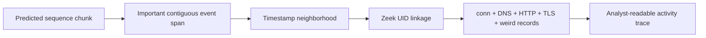

# Professor Demo Guide

## 1. 项目一句话介绍

本项目研究能否从 CICIoT2023 原始 PCAP 中提取按时间排序的协议语义事件，并通过分层 LSTM 自动学习正常与攻击活动模式，同时避免平均值、标准差、流量速率、滑动窗口统计等人工特征工程。

English version:

> This project investigates whether a hierarchical LSTM can identify interpretable IoT intrusion activity patterns directly from chronological protocol-semantic events extracted from raw CICIoT2023 packet captures, without manually aggregated traffic features.

## 2. Demo 开场重点

建议先向教授说明三个核心点：

1. 输入不是 CICIoT2023 官方的预计算 CSV，而是原始 PCAP。
2. Zeek 只作为协议解析器，把包转换为直接可解释的协议事件；模型没有使用平均值、标准差、包速率、流持续时间或滑动窗口统计。
3. 模型不仅输出类别，还通过 occlusion 定位关键事件片段，并映射回 Zeek 日志，重建相关连接和协议记录。

建议避免说“完全从原始字节端到端”。更准确的说法是：

> The learning pipeline is end to end from protocol-semantic events, while Zeek provides deterministic protocol parsing rather than manually aggregated statistical features.

## 3. 研究问题与动机

传统 CICIoT2023 分类方法通常直接使用官方 CSV，其中包含 `flow_duration`、`Rate`、`AVG`、`Std`、`Variance`、`Covariance` 等预计算特征。这些特征有三个问题：

- 研究人员需要预先决定应该计算什么，容易引入任务特定的人工偏见。
- 聚合会压缩原始时间顺序，可能丢失协议状态转换和重复行为。
- 大规模滑动窗口与统计计算会增加数据处理成本。

本项目保留协议本身已经定义的语义，例如 TCP 连接状态、HTTP 方法、DNS 操作和 TLS 状态，让 LSTM 从事件顺序、重复和上下文中学习活动表示。

## 4. 当前数据范围

CICIoT2023 官方论文描述了 105 台 IoT 设备、7 个攻击类别和 33 种攻击。当前本地实验包含：

- 8 个粗类别：Benign、DDoS、DoS、Recon、Web-based、Brute Force、Spoofing、Mirai。
- 34 个模型输出标签：33 种官方攻击加 Benign。
- 34 个本地 PCAP，每个标签使用 1 个 PCAP。
- 3,228 个 parent chunks，经 split-preserving 重分块后得到 51,383 个连续、非重叠的 256-event segments，其中训练集 41,043 个、验证集 10,340 个。
- 重分块前后都是同一批 34 个 PCAP；segment 数量增加不等于独立 capture 数量增加。

### 必须向教授说明的覆盖状态

`DDoS-ICMP Fragmentation` 已经下载、处理并加入 DDoS fine head。当前配置是：

```text
33 official attacks + Benign = 34 output labels
```

可以说：

> The current checkpoint covers all 33 official attacks plus Benign. DDoS-ICMP Fragmentation is included, but its 121 event segments all come from one PCAP, so it remains independent-capture-scarce.

数据来源：

- [UNB CICIoT2023 dataset page](https://www.unb.ca/cic/datasets/iotdataset-2023.html)
- [CICIoT2023 original paper](https://www.mdpi.com/1424-8220/23/13/5941)

## 5. 系统流程

```mermaid
flowchart LR
    A["CICIoT2023 PCAP"] --> B["Zeek protocol logs"]
    B --> C["Chronological semantic events"]
    C --> D["Parent chunks and split assignment"]
    D --> D2["Non-overlapping 256-event segments"]
    D2 --> E["Learned token embeddings"]
    E --> F["LSTM sequence encoder"]
    F --> G["8-category coarse head"]
    G --> H["Category-specific fine head"]
    H --> I["Hierarchical prediction"]
    I --> J["Occlusion-based salient span"]
    J --> K["Zeek UID and timestamp trace reconstruction"]
```



### Zeek 事件输入

每条 Zeek 日志记录变成一个时间步。例如：

```text
log=conn proto=tcp service=http conn_state=SF history=SADhgFadf resp_port=80
log=http method=GET version=1.1 status_code=200
log=dns qtype_name=A rcode_name=NOERROR opcode_name=query rejected=false
```

模型输入包含：

- 日志类型、传输协议和服务类型。
- `conn_state` 与 TCP `history`。
- responder service port。
- HTTP method/version/status。
- DNS query type、response code 和 operation。
- TLS、SSH、DHCP 状态和 Zeek anomaly 名称。

模型输入排除：

- IP 地址、Zeek UID、源端临时端口。
- duration、bytes、packet totals 和 rates。
- mean、standard deviation、variance、covariance。
- rolling or sliding-window aggregates。

IP、UID 和原始字段只在预测后的解释阶段使用，用来关联 Zeek 日志，不会进入 LSTM。

## 6. 模型结构

当前模型使用一个分层分类结构：

```text
protocol tokens
  -> 32-dimensional learned embeddings
  -> LSTM with hidden dimension 64
  -> sequence representation
  -> 8-category coarse classifier
  -> category-specific fine classifier
```

主要训练参数：

| Setting | Value |
| --- | ---: |
| Epochs | 4 |
| Batch size | 64 |
| Maximum events per segment | 256 |
| Embedding dimension | 32 |
| LSTM hidden dimension | 64 |
| Coarse loss weighting | Balanced |
| Fine loss weighting | Balanced |
| Coarse/fine task weights | 1.0 / 0.25 |
| Fine loss reduction | Sample-normalized |
| Validation segments | 10,340 |

训练时，真实粗类别用于选择对应 fine head 并计算 fine loss。推理时，模型先预测粗类别，再调用预测类别对应的 fine head。因此存在两种错误：

- Coarse gate error：第一层选择了错误攻击类别。
- Fine-head error：粗类别正确，但混淆了同一类别内部的攻击。

## 7. 当前主实验结果

### 7.1 分层模型总体结果

| Metric | Result | Meaning |
| --- | ---: | --- |
| Coarse accuracy | 91.77% | 8 个粗类别的总体准确率 |
| Coarse balanced accuracy | 85.19% | 8 类 recall 的宏平均 |
| Coarse Macro F1 | 81.26% | 对少数类别给予相同权重 |
| Fine accuracy given true category | 82.65% | 使用真实粗类别选择 fine head |
| Fine balanced accuracy given true category | 72.99% | 条件 fine recall 宏平均 |
| Fine Macro F1 given true category | 69.74% | 条件细分类 Macro F1 |
| Full hierarchical path accuracy | 75.98% | 粗类别和细标签同时正确 |

最重要的报告规则：

- `69.74%` 是在真实粗类别已知时测量 fine head，不是完整系统的 34 类准确率。
- `75.98%` 才表示完整层级路径是否同时正确。
- `91.77%` 仍可能受 DDoS 和 DoS 大类支配，因此必须同时报告 Macro F1 和 Balanced Accuracy。

与旧 128-event prefix baseline 相比，coarse accuracy 提高 6.69 个百分点、coarse Macro F1 提高 21.27 个百分点、full path accuracy 提高 5.98 个百分点。关键变化是事件利用率从 3.1% 提升到 100%，以及 fine loss 从按类别求和改为按样本归一化并降低到 0.25 权重。

### 7.2 从粗分类结果推导的二元检测结果

把所有攻击类别合并为 Malicious，可以从同一 8 类预测结果推导出：

| Derived binary metric | Result |
| --- | ---: |
| Accuracy | 98.48% |
| Attack precision | 99.98% |
| Attack recall | 98.45% |
| Attack F1 | 99.21% |
| False-positive rate on Benign | 0.63% |

这不是独立训练的 binary model，而是对当前 8 类预测进行 Benign/Malicious 合并后的结果。高二元指标说明识别“是否攻击”相对容易；低一些的 Macro F1 和 path accuracy 说明区分攻击类别与攻击子类型更困难。

### 7.3 粗类别 Precision、Recall 和 F1

| Category | Validation support | Precision | Recall | F1 |
| --- | ---: | ---: | ---: | ---: |
| Benign | 320 | 67.2% | 99.4% | 80.2% |
| DDoS | 4,785 | 95.0% | 91.3% | 93.1% |
| DoS | 3,577 | 92.9% | 93.0% | 92.9% |
| Recon | 1,056 | 97.0% | 86.6% | 91.5% |
| Web-based | 67 | 31.7% | 65.7% | 42.7% |
| Brute Force | 4 | 100.0% | 50.0% | 66.7% |
| Spoofing | 195 | 86.9% | 99.0% | 92.6% |
| Mirai | 336 | 84.9% | 96.7% | 90.4% |

Web-based 和 Brute Force 已不再是 0% recall，但这些 segments 仍来自各自单一 PCAP，因此不能把增加后的 support 当作独立实验重复。

### 7.4 具有较稳定证据的 fine labels

以下类别在主实验中有较好的 fine-head F1 和完整 path recall：

| Fine label | Validation segments | Conditional F1 | Full path recall |
| --- | ---: | ---: | ---: |
| Benign | 320 | 100.0% | 99.4% |
| DDoS-ACK fragmentation | 336 | 99.4% | 99.1% |
| DDoS-SlowLoris | 304 | 92.1% | 83.2% |
| DDoS-RSTFIN flood | 145 | 96.6% | 98.6% |
| DDoS-HTTP flood | 768 | 99.1% | 71.2% |
| DDoS-SynonymousIP flood | 384 | 89.3% | 97.4% |
| DoS-TCP flood | 336 | 99.7% | 80.4% |
| DoS-HTTP flood | 2,681 | 99.9% | 99.3% |
| DoS-UDP flood | 176 | 99.4% | 90.3% |
| Recon-Host discovery | 192 | 95.7% | 99.0% |
| Spoofing-Arp spoofing | 83 | 79.0% | 77.1% |
| Spoofing-DNS spoofing | 112 | 85.1% | 84.8% |

`DDoS-ICMP Fragmentation` 的 conditional fine precision/recall/F1 是 47.4%/56.3%/51.4%，但 full-path recall 仍为 0%。其 89 个训练和 32 个验证 segments 都来自同一 PCAP；重分块增加了时间覆盖，没有增加独立行为多样性。

### 7.5 重复划分稳定性

旧 128-event baseline 使用 seeds 7、11 和 23 进行了三次 6-epoch development runs：

| Seed | Coarse accuracy | Coarse Macro F1 | Conditional fine Macro F1 | Path accuracy |
| ---: | ---: | ---: | ---: | ---: |
| 7 | 83.4% | 56.9% | 66.1% | 66.3% |
| 11 | 81.2% | 54.1% | 58.1% | 64.0% |
| 23 | 79.4% | 52.6% | 58.6% | 65.5% |

完整路径准确率保持在 `64.0%` 到 `66.3%`。这些是旧 baseline 的稳定性结果，不能作为新 91.77% 模型的 repeated-run 证据；新配置仍需重复运行。

## 8. Activity Pattern Identification

分类结果之后，系统使用 contiguous-window occlusion：

1. 计算原始序列的预测概率。
2. 每次遮挡一段连续事件。
3. 再次计算预测概率。
4. 如果遮挡后目标路径概率大幅下降，则该事件区间被视为重要活动片段。
5. 使用时间戳和 Zeek UID 映射回 `conn.log`、`dns.log`、`http.log`、`ssl.log` 和 `weird.log`。

当前已经提取 25 个正确预测的 fine-label activity examples。所有 example 都保留 parent chunk、`event_start/event_stop` 和 salient span 全局偏移，并成功重建 Zeek trace。DDoS-ICMP Fragmentation 因为没有正确的 full-path validation prediction，仍未被加入。

### 可展示的例子

Benign example：

```text
DNS A query / NOERROR
-> repeated successful DNS connections
-> established HTTP connection with conn_state=SF
```

DDoS-ACK Fragmentation example：

```text
conn/tcp/OTH/history=D/port=554
-> repeated many times within a short interval
```

DDoS-SlowLoris example：

```text
HTTP GET
-> RSTR connection state
-> data_before_established / possible_split_routing
-> repeated HTTP 400 responses
```

DDoS-PSHACK example：

```text
conn/tcp/RSTRH/history=Ar/port=4070
-> repeated reset/ack-related states
-> TCP sequence misorder anomalies in reconstructed trace
```

这些模式由训练后的模型和 occlusion 选择，不是提前写入的 Snort-style rules。但 occlusion 只表示模型敏感性，不应被描述为严格的因果解释。

## 9. Multi-connection and Session Reconstruction

多连接关联不是与分类分离的第二个项目，而是解释输出的一部分。



设计边界：

- LSTM 只接收去标识化的 protocol-semantic tokens。
- UID、IP 和更宽时间范围只在预测后的 trace reconstruction 中使用。
- 如果一个 activity 涉及多个连接，解释层可以显示这些相关日志。
- 当前主模型没有把 session graph 或 UID 作为输入，因此不会因标识符获得不公平的分类优势。

## 10. 建议的现场 Demo 流程

### Step 1: 介绍问题与输入

打开 `README.md` 和研究计划，说明为什么使用 PCAP 而不是官方 CSV。

重点句：

> I am not asking the model to classify precomputed averages or flow statistics. Each time step is a direct protocol-semantic event generated by Zeek.

### Step 2: 展示事件表示

展示一个 sequence JSONL，指出事件仍然保持原始时间顺序，并且没有 IP、duration、bytes、mean 或 standard deviation。

```bash
head -n 1 data/sequences/Benign_Final/BenignTraffic.jsonl
```

### Step 3: 展示分层模型

打开：

```text
src/activity_patterns/model.py
src/activity_patterns/labels.py
```

讲解 coarse head 与 category-specific fine heads，以及 path accuracy 的定义。

### Step 4: 展示实验指标

```bash
sed -n '1,120p' artifacts/evaluation_event256_joint/metrics.json
sed -n '1,40p' artifacts/evaluation_event256_joint/coarse_per_class_metrics.csv
```

先讲 Macro F1 和 Balanced Accuracy，再讲 accuracy，避免教授认为只展示受大类别支配的指标。

### Step 5: 展示 activity pattern 与 trace

```bash
sed -n '1,160p' artifacts/activity_patterns_event256_joint/patterns.md
```

展示 occlusion drop、salient events 和 reconstructed Zeek trace。Benign、DDoS-ACK Fragmentation 或 SlowLoris 都比较容易解释。

### Step 6: 展示代码可靠性

```bash
PYTHONPATH=src .venv/bin/python -m unittest discover -s tests -v
```

当前结果应为 15 个测试全部通过。

## 11. Limitations

### 11.1 新增类别仍然样本不足

`DDoS-ICMP Fragmentation` 已纳入完整 34-label 模型。重分块后有 89 个训练和 32 个验证 segments，但它们来自同一个 PCAP，且 full-path recall 仍为 0%。因此只能作为完整覆盖和失败机制证据，不能作为稳定识别结论。

### 11.2 当前验证不是 capture-disjoint

每个当前类别只有一个本地 PCAP。为了进行开发验证，同一 PCAP 被切成多个连续 chunks，再按 fine label 分配到 train 和 validation。虽然没有打乱 chunk 内部事件，但同一 capture 的相似流量可能同时出现在训练和验证中。

因此当前指标只能称为：

```text
development / within-capture validation results
```

不能称为：

```text
unseen-capture or real-world generalization results
```

### 11.3 严重类别不平衡

重分块提高了每个类别的 segment 数量，但 DoS/DDoS 仍占大多数，而且每个标签通常只有一个独立 PCAP。Balanced loss 可以调整训练权重，但不能创造新的设备、场景或 capture 多样性。

### 11.4 大型 flood capture 使用开发采样

若干大型 DDoS/DoS PCAP 的开发序列来自最多 200,000 行 Zeek `conn.log` 的样本。完整 Zeek 日志仍保留，但当前训练没有使用所有大型 capture 事件。因此结果反映的是 memory-safe development configuration。

### 11.5 纯协议状态难以区分 Web payload attacks

SQL injection、XSS 和 command injection 可能具有相同 HTTP method 和连接状态。当前模型没有学习原始 URI 或 payload 内容，协议状态本身不足以可靠区分这些攻击。

合理扩展是增加 learned character/byte encoder，而不是人工设计 SQL keyword counts。

### 11.6 256-event segment 的边界限制

新模型完整读取每个 256-event segment，修复了只读取 4,096-event parent chunk 前 128 个事件的问题。连续重分块不重叠、不计算窗口统计，但跨越 segment 边界的 activity 仍会被分开。

### 11.7 会话关联仍是 post-hoc interpretation

当前分类输入是全局按时间排序的 chunks。trace reconstruction 可以在预测后连接多个 Zeek logs，但 LSTM 本身没有显式 session graph。如果多个无关连接在同一时间段交错，模型可能学习到混合上下文。

### 11.8 尚缺最终 baseline 与 ablation

当前尚未完成：

- Suricata 或 Snort signature baseline。
- Majority-class baseline 的正式表格。
- 移除 `conn_state/history` 的 ablation。
- 移除应用层日志的 ablation。
- Flat classifier 与 hierarchical classifier 的正式对比。
- Capture-disjoint test、推理吞吐量和正式 Wireshark validation record。

### 11.9 Occlusion 不是因果证明

Occlusion drop 表示删除该事件片段会降低模型置信度，但不能证明该片段在现实中导致攻击，也不能保证它是唯一解释。

## 12. 可以与不可以提出的结论

### 当前可以提出

- 已建立可复现的 PCAP-to-Zeek-to-event-to-LSTM pipeline。
- 模型没有使用人工聚合流量统计。
- 分层模型能够对 8 个粗类别和完整 34 个输出标签进行端到端训练。
- 当前 within-capture validation 的 coarse accuracy 为 91.8%，coarse Macro F1 为 81.3%，full path accuracy 为 76.0%。
- 模型能为多个稳定类别提取可读的 protocol activity spans，并重建相关 Zeek traces。
- 旧 128-event baseline 的三次随机划分 path accuracy 为 64.0% 到 66.3%；新配置尚未完成 repeated runs。

### 当前不应提出

- 不应把“完整标签覆盖”说成“所有 33 种攻击都已可靠识别”。
- 不应把 98.3% binary projection accuracy 说成独立训练模型或最终系统性能。
- 不应声称模型已经证明对未知 capture、未知设备或真实网络泛化。
- 不应说所有 Web-based attacks 已被可靠识别。
- 不应把 occlusion span 描述为攻击的因果根源。
- 不应说完全没有 representation engineering；Zeek parsing 和 sequence boundary 仍是设计选择。

## 13. 教授可能提出的问题

### Q1: Is Zeek also feature engineering?

回答：Zeek performs deterministic protocol parsing. The model receives direct protocol states and operations, not manually aggregated traffic statistics. Representation choices still exist, so the claim is not “zero preprocessing.”

### Q2: Why use an LSTM?

回答：The target information is sequential. Connection states, repeated failed handshakes, HTTP operations, and protocol anomalies form ordered patterns. An LSTM can learn dependencies across these event transitions.

### Q3: Why hierarchical classification?

回答：The dataset already has a category hierarchy. The model first separates broad behavior such as DDoS, Recon, and Mirai, then distinguishes sibling attacks. It also lets us identify whether an error came from category selection or fine discrimination.

### Q4: Why is binary performance high but Macro F1 lower?

回答：Distinguishing malicious from benign is easier than distinguishing DDoS from DoS or different attacks inside Recon. Macro F1 also gives rare Web and Brute Force classes equal importance, exposing limitations hidden by overall accuracy.

### Q5: Does repeated splitting solve data leakage?

回答：No. It measures split sensitivity but still uses chunks from the same captures. A final generalization claim requires independent capture-, scenario-, or device-grouped testing.

### Q6: How is multi-connection tracking integrated?

回答：After prediction, the salient interval is mapped back through timestamps and Zeek UIDs to linked conn, DNS, HTTP, TLS, and anomaly records. The tracking is part of activity interpretation, while identifiers remain excluded from model input.

### Q7: What is the next highest-priority task?

回答：Obtain a capture-disjoint test split or additional captures per label. After that, add a signature baseline, focused representation ablations, and a longer-sequence experiment.

## 14. Two-minute English Presentation Script

> My project investigates whether intrusion activity can be learned from ordered protocol semantics instead of manually engineered flow statistics. I use the original CICIoT2023 PCAP files and Zeek as a deterministic protocol parser. Each Zeek connection, HTTP, DNS, TLS, or anomaly record becomes one chronological event. I exclude IP addresses, UIDs, duration, byte totals, packet rates, means, standard deviations, and rolling aggregates from the model input.
>
> The neural model embeds the categorical fields, processes each non-overlapping 256-event segment with an LSTM, and performs hierarchical classification. The first head predicts Benign or one of seven attack categories. A category-specific second head predicts the attack subtype. The improved preprocessing retains all available protocol events instead of only the first 128 events of each parent chunk. On the current within-capture validation set, coarse accuracy is 91.8 percent, coarse Macro F1 is 81.3 percent, conditional fine Macro F1 is 69.7 percent, and full hierarchical path accuracy is 76.0 percent.
>
> The system also performs activity-pattern identification. I occlude contiguous event spans and measure the probability drop. Important spans are then mapped back to Zeek timestamps and UIDs to reconstruct related connection and application-protocol records. This provides an analyst-readable trace rather than only a class label.
>
> The main limitation is the validation protocol. The larger segment count comes from re-chunking the same 34 local PCAP files, and the current split is within-capture rather than capture-disjoint. The checkpoint covers all 33 official attacks plus Benign, but complete label coverage does not mean reliable recognition of every class. Therefore, these are development results that demonstrate the method, not a final claim of real-world generalization.

## 15. Demo 文件索引

- Main metrics: `artifacts/evaluation_event256_joint/metrics.json`
- Coarse class metrics: `artifacts/evaluation_event256_joint/coarse_per_class_metrics.csv`
- Fine class metrics: `artifacts/evaluation_event256_joint/fine_per_class_metrics.csv`
- Confusion matrices: `artifacts/evaluation_event256_joint/*confusion_matrix.csv`
- Repeated split summary: `artifacts/repeated_fine_splits/summary.md`
- Fine-label stability: `artifacts/repeated_fine_splits/label_stability.md`
- Error analysis: `artifacts/error_analysis_event256_joint/weak_fine_labels.md`
- Activity examples and traces: `artifacts/activity_patterns_event256_joint/patterns.md`
- Trained checkpoint: `runs/hierarchical_event256_joint/best_model.pt`
